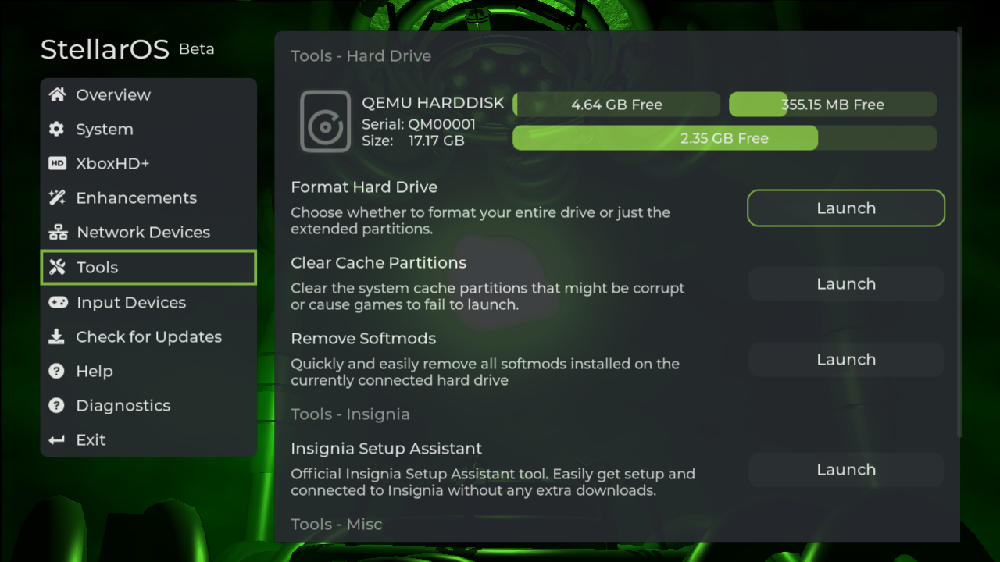

# Hard Drive Partitions

## Overview
For those who have dabbled in formatting drives, setting up Windows, or experimenting with different operating systems, the concept of hard drive partitions might be familiar.



However, if you're new to the subject, this guide is here to assist.

[Wikipedia](https://en.wikipedia.org/wiki/Disk_partitioning) offers a concise description of disk partitioning:
> Disk partitioning or disk slicing is the creation of one or more regions on secondary storage, so that each region can be managed separately. These regions are called partitions. It is typically the first step of preparing a newly installed disk, before any file system is created.

Similarly to a PC, the Xbox's hard drive is divided into multiple partitions.

## Retail Partitions
These partitions are essential to the Xbox and are present even in an unmodified, stock system.

The sizes of these partitions are fixed and cannot be altered. For drives larger than the standard size, extended partitions come into play, which will be discussed in the following section.

| Partition   | Drive Letter | Description                          | Size   |
|-------------|--------------|--------------------------------------|--------|
| Partition 2 | C            | System (Retail Dashboard)            | 500MB  |
| Partition 1 | E            | Data (Saved Games and Title Updates) | 4.77GB |
| Partition 3 | X            | Game Cache                           | 750MB  |
| Partition 4 | Y            | Game Cache                           | 750MB  |
| Partition 5 | Z            | Game Cache                           | 750MB  |

:::tip
In the realm of modding, it's widely regarded as best practice to retain the original content of files and avoid storing unrelated files in these partitions. While it's permissible to do so, it's preferable to maintain a clean setup.
:::

## Extended Partition(s)
On systems that have been modified to include larger storage areas, extended partitions are employed. Within the scope of Project Stellar, we utilize just one extended partition, designated as Drive F, which serves as the storage space for games, homebrew, applications, and custom dashboards.

### Paths
In general, files can be organized in any folder structure that seems logical. However, this guide will focus on naming conventions that are widely recognized and compatible with both Project Stellar and other homebrew applications.

#### Custom Dashboard
Project Stellar will attempt to boot a custom dashbaord located at ``F:\Dashboard\default.xbe`` on boot

```
F:\
  Dashboard\
    default.xbe
    <Additional dashboard files>...
  ...
```

:::tip
Most custom dashboards include several files besides ``default.xbe``. All these files must be moved to the ``F:\Dashboard`` directory, ensuring they are in the same location as ``F:\Dashboard\default.xbe``.
:::

#### Games
Game backups are typically stored in a folder on the ``F Parition`` matching the ``F:\Games\<Game Name>`` schema.

```
F:\
  Games\
    Halo\
      default.xbe
      <Additional game files>...
    Halo 2\
      game.iso
      attache.xbe
  ...
```

#### Applications/Homebrew
Applications and homebrew are typically stored in a folder on the ``F Parition`` matching the ``F:\Apps\<Application/Homebrew Name>`` schema.

```
F:\
  Apps\
    AppName\
      default.xbe
      <Additional files>...
  ...
```

## Additional Resources
* [Xbox Dev Wiki - Hard Drive](https://xboxdevwiki.net/Hard_Drive)
