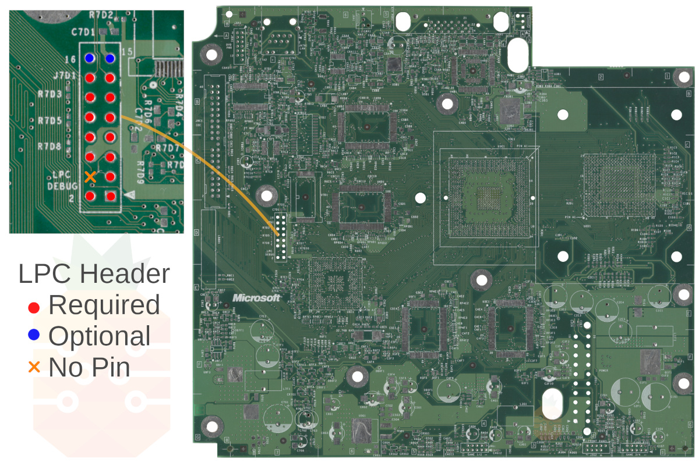
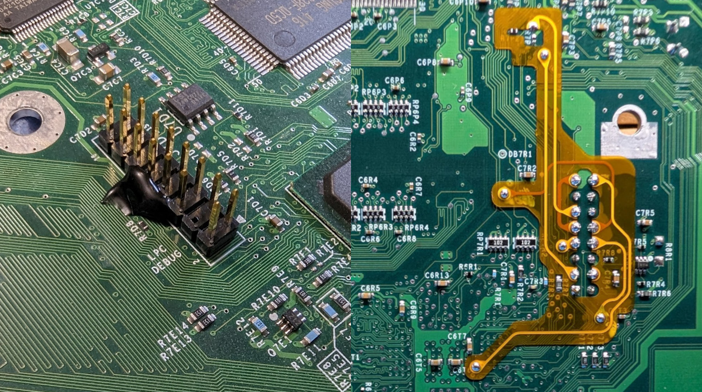
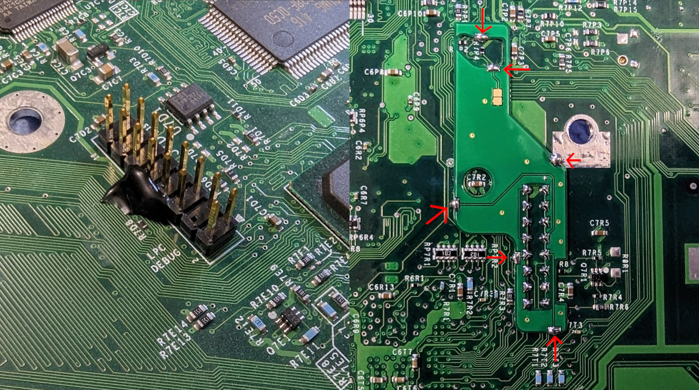
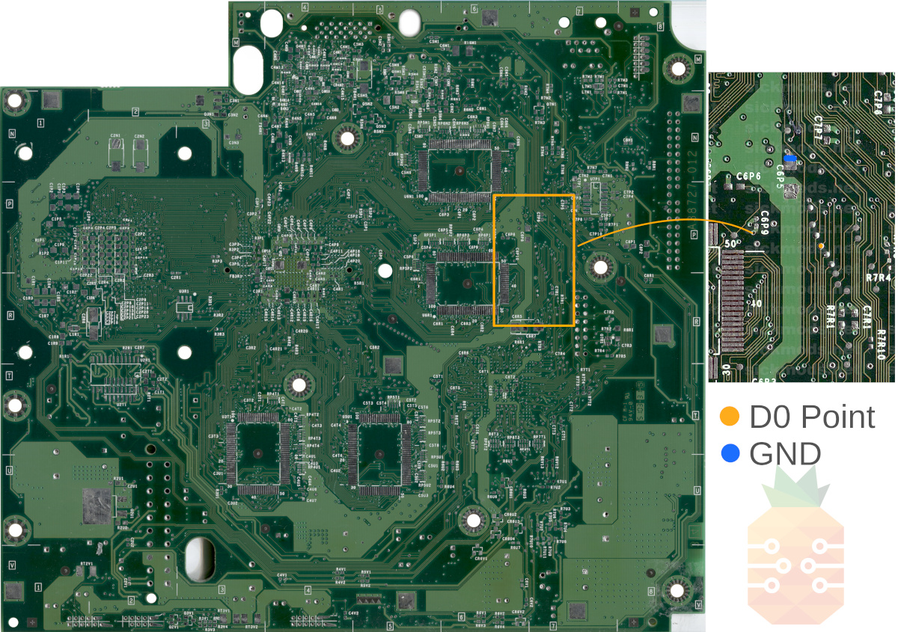
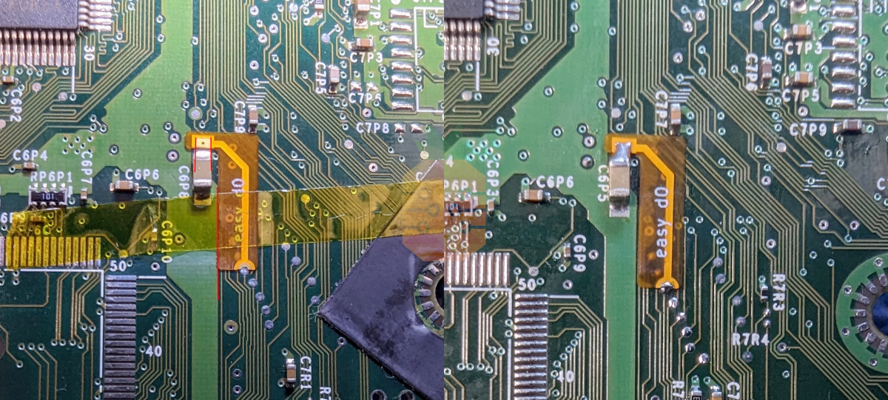
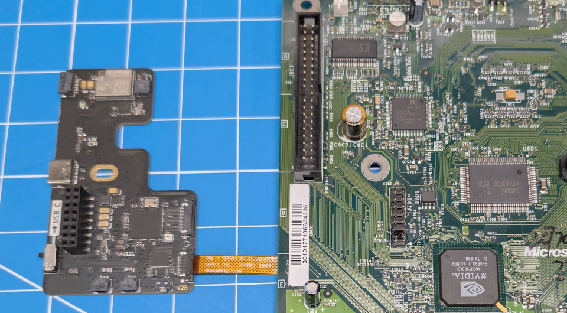
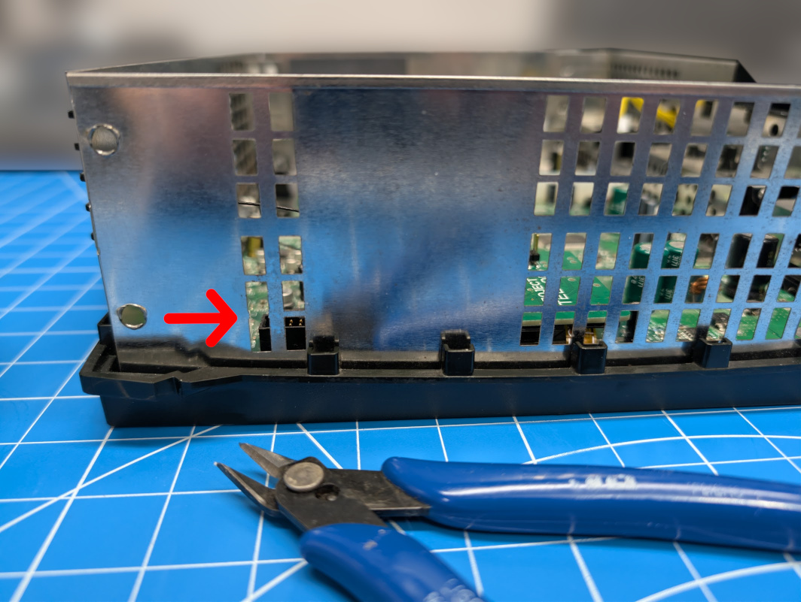
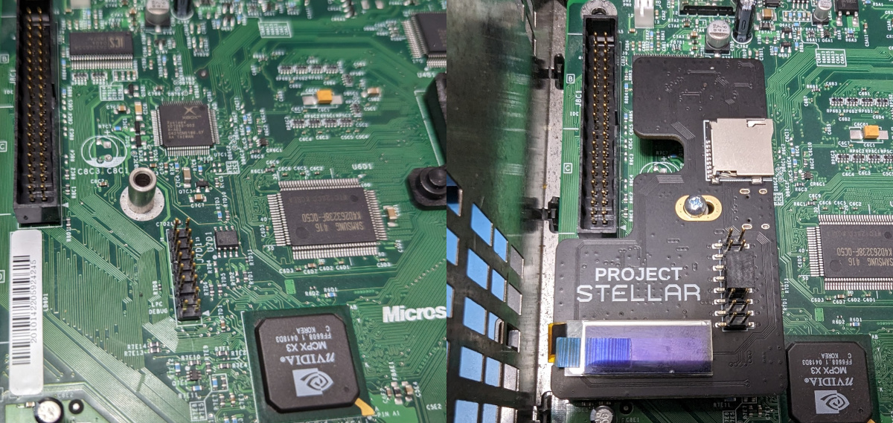
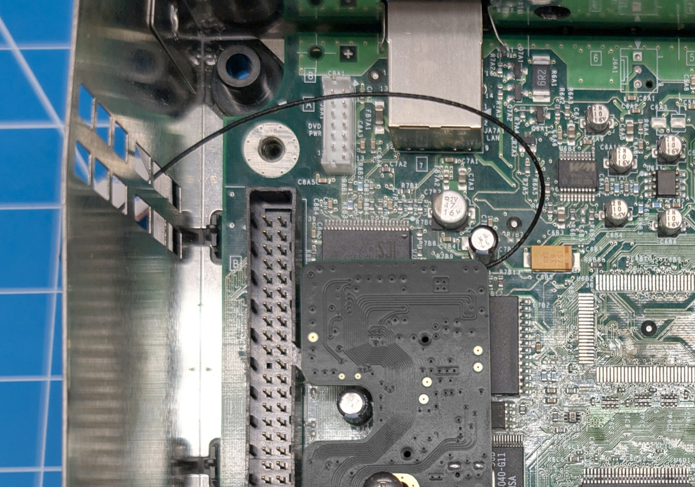
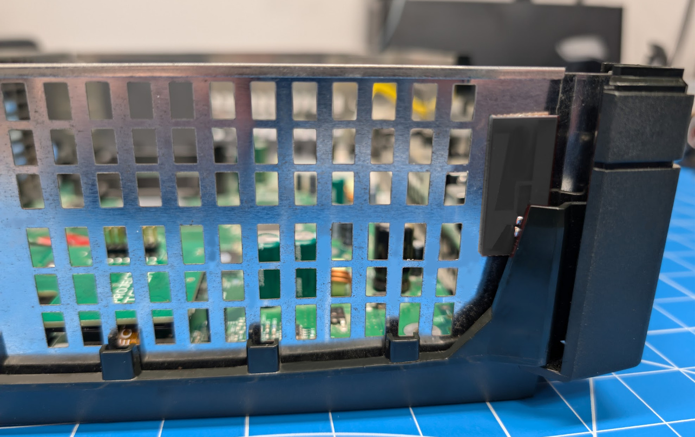

import Tabs from '@theme/Tabs';
import TabItem from '@theme/TabItem';

# Installation Guide
Installation guide for installing Project Stellar.

## Preparation
:::caution
Before your adventure begins, it's imperative to ensure that you have a fully working and tested Xbox.
:::

### Kit Contents
Check your kit for missing or damaged pieces before moving forwards.

- Project Stellar
- Easy D0
- Xbox 1.6 LPC Rebuild QSB
- Metal Stand-off with Screw
- 2x8 Gold Plated Pinheader

### Resources
[Identifying Xbox Revision](/xbox/identifying-xbox-revision)

[Initial Setup](/project-stellar/initial-setup)

## Step 1 - Initial Setup
:::info
The initial setup process must be completed first and is provided as a seperate guide.
[Initial Setup](/project-stellar/initial-setup)
:::

## Step 2 - LPC Pin Header
Project Stellar currently requires that at minimum a 2x7 pin header be installed on the LPC of the Xbox. It's recommended to install the included high-quality gold-plated 2x8 pin header if possible as future features may require the additional pins.

### Xbox Revisions 1.0 - 1.5
- Locate the LPC header on the motherboard.
- Remove factory solder from the through holes.
- Solder in the supplied pin header.

### Xbox Revision 1.6
Installation of the pin header on a 1.6 revision motherboard requires that we solder in the LPC rebuild QSB while holding the pin header in place. For this, we recommend using hot glue, Blu-Tack, or some other temporary adhesive.

- Locate the LPC header on the motherboard.
- Remove factory solder from the through holes.
- Solder in the supplied LPC rebuild QSB while holding in place the pin header. Make sure to solder all of the points on the QSB to the motherboard.

<Tabs groupId="stellar-rev">
<TabItem value="stellar-plus" label="Stellar Plus">

</TabItem>
<TabItem value="stellar" label="Stellar">

</TabItem>
</Tabs>

## Step 3 - Easy D0
For Xbox revisions 1.0 - 1.5 we must connect D0 to ground to force the system to always boot from the LPC port. On the 1.6 motherboard, this is handled automatically by Project Stellar.

- Align the Easy D0 QSB and tape down according to the reference images provided below.
- Solder the QSB into place.

## Step 4 - Wireless Flex (Stellar Plus)
The wireless flex installation points vary by motherboard version, so make sure you are following the correct layout
for your console. Carefully compare the photo with your board before soldering.

**Select the tab below that matches your Xbox motherboard revision before continuing.**

<Tabs groupId="xbox-rev">
<TabItem value="1" label="Xbox 1.0 - 1.1">

- **Position the Stellar Wireless flex cable and carefully align it with the board.** Confirm that all contact points are lined up
correctly, and that each test pad matches the corresponding pad on the flex.
- Position the 1.0 - 1.1 standby power flex cable and solder it into place.
- **Optional, but highly recommended:** Add the minimum amount of solder needed to the large ground pad to firmly secure the wireless
flex to the Xbox motherboard. Do not use too much solder. Excess solder can prevent the motherboard from sitting flat in the console shell.

</TabItem>
<TabItem value="2" label="Xbox 1.2 - 1.5">

- **Position the Stellar Wireless flex cable and carefully align it with the board.** Confirm that all contact points are lined up
correctly, and that each test pad matches the corresponding pad on the flex.
- Position the 1.2 - 1.5 standby power flex cable and solder it into place.
- **Optional, but highly recommended:** Add the minimum amount of solder needed to the large ground pad to firmly secure the wireless
flex to the Xbox motherboard. Do not use too much solder. Excess solder can prevent the motherboard from sitting flat in the console shell.

</TabItem>
<TabItem value="6" label="Xbox 1.6">

- **Position the Stellar Wireless flex cable and carefully align it with the board.** Confirm that all contact points are lined up
correctly, and that each test pad matches the corresponding pad on the flex.
- **Optional, but highly recommended:** Add the minimum amount of solder needed to the large ground pad to firmly secure the wireless
flex to the Xbox motherboard. Do not use too much solder. Excess solder can prevent the motherboard from sitting flat in the console shell.

</TabItem>
</Tabs>

---

Carefully insert the flex PCB into the FPC connector on Stellar Plus. Make sure the flex is fully seated, straight, and aligned evenly with the connector before locking it in place.

## Step 5 - Shielding Modification (Stellar Plus)

Before reinstalling the motherboard, make a small modification to the Xbox RF shielding so the antenna can pass through.
Use side cutters to remove the small metal tab shown in the image below.

:::note
Modifying the RF shielding is not required, but it is highly recommended. Following this step helps keep the antenna routing simple
and makes the installation easier.
:::

## Step 6 - Mounting

- Place the provided metal spacer over the PCB hole as shown.
- **Connect Project Stellar to the Xbox motherboard while the motherboard is still outside the console.** Insert the provided screw into
the screw hole to help keep the spacer from sliding out while placing the motherboard back into the console shell.
- Use the provided Phillips screw to mount Project Stellar. Do not over-tighten, the screw only needs to be lightly tightened.

## Step 7 - Antenna Routing (Stellar Plus)

Carefully route the antenna cable between the IDE connector and the DVD power cable, then pass it through the opening in the RF
shielding made in the previous step.

Keep the cable loose with a gentle curve to avoid placing stress on the cable or connector.

Route the antenna cable along the edge of the console shell.
Remove the backing from the double-sided tape on the antenna, then secure the antenna in place as shown below.

## Done
If you have an HDMI kit, then you can use the links below to install those.

[Stellar XboxHD+ Installation Guide 1.0 - 1.5](/stellar-xboxhd/installation/stellar-xboxhd-1-0)

[Stellar XboxHD+ Installation Guide 1.6](/stellar-xboxhd/installation/stellar-xboxhd-1-6)
