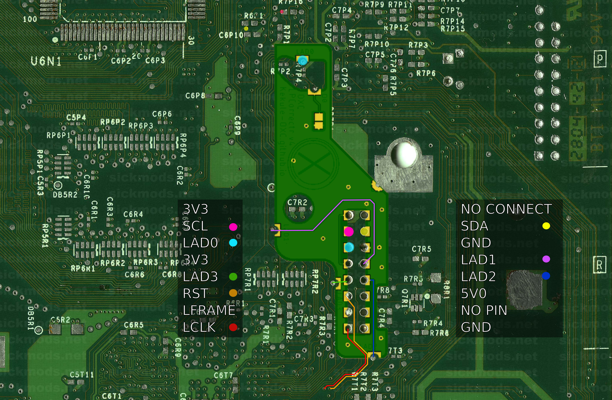

# Installation Troubleshooting

## Overview
While Project Stellar's installation is designed to be straightforward, rest assured we're here to assist if any challenges arise.

## Common Solutions and Checks
Below are a few common checks that can be checked first.
* Verify that each step in the [Initial Setup](/project-stellar/initial-setup) was followed.
* Verify that each step in the [Installation Guide](/project-stellar/installation-guide) was followed.

:::tip
When in doubt, a [Firmware Recovery](/project-stellar/firmware-recovery) via USB is always an option to make sure you're on the last firmware version.
:::

## Common Issues

### KERNEL MISSING
An ``KERNEL MISSING`` will display on the OLED display if the [Initial Setup](/project-stellar/initial-setup) was not fully completed.

### XCODE STALLED
An ``XCODE STALLED`` can display on the OLED display when Stellar fails to properly boot.
* Double check the solder points on the LPC header.
* If the system is 1.6, verify that all points on the LPC rebuild are properly soldered.

Should the issue persist, it would be advisable to start by examining the LPC connections in reference to the LPC trace diagrams provided below.

### System Rebooting/Flash Red and Green (FRAG)
If the system is rebooting three times and flashes red and green then refer to [XCODE STALLED](#xcode-stalled).

## LPC Trace Diagrams

### 1.0 - 1.1
[PNG Image](./images/lpc_traces_1_0.jpg)

### 1.2 - 1.5
[PNG Image](./images/lpc_traces_1_2.jpg)

### 1.6
[PNG Image](./images/lpc_traces_1_6.jpg)

