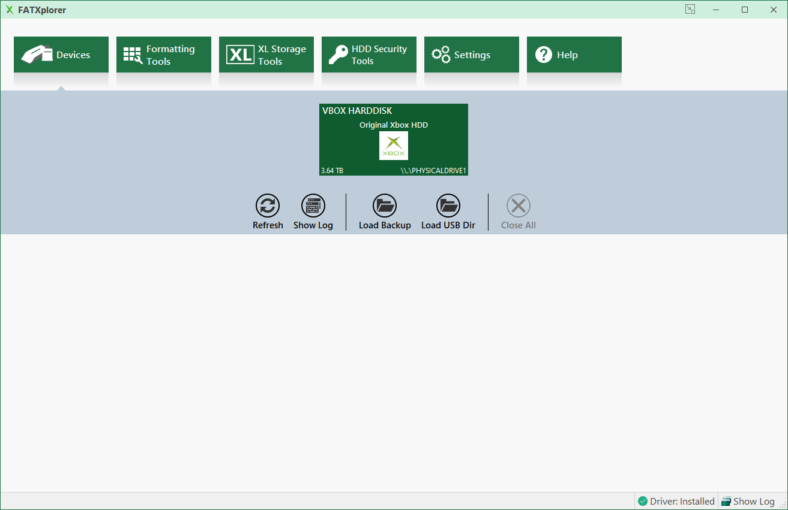
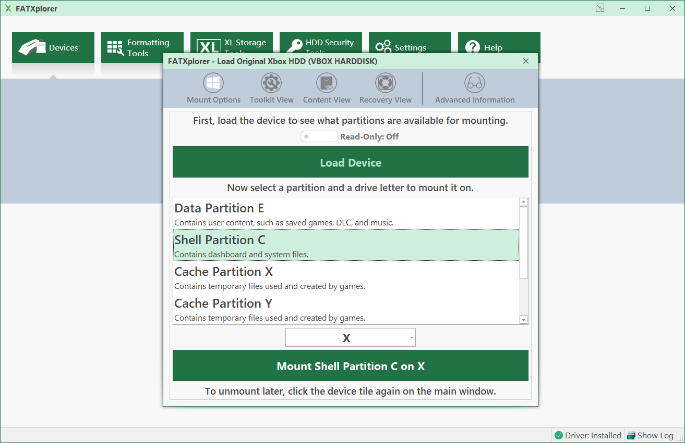
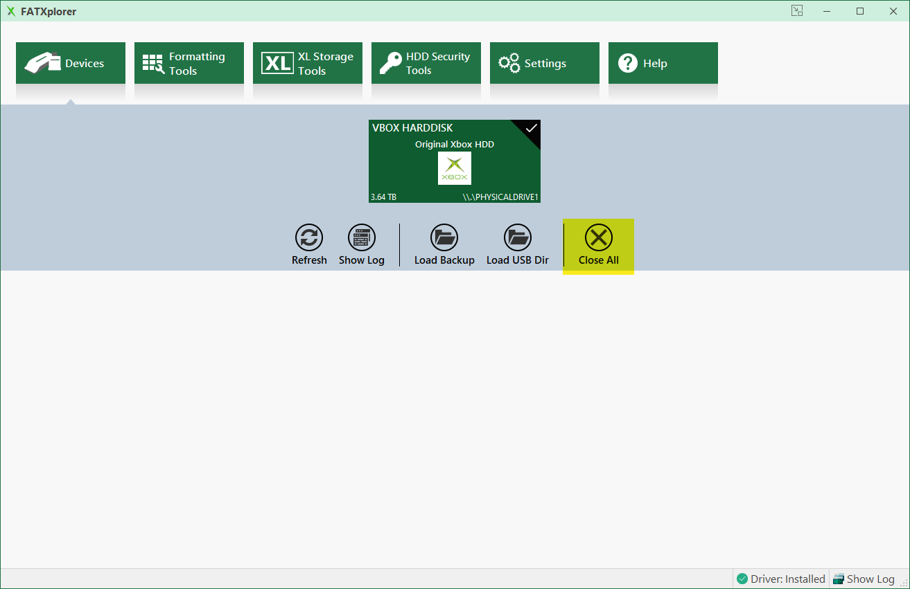

# FATXplorer

## Overview
[FATXplorer](https://fatxplorer.eaton-works.com/), developed by Eaton Works, offers a user-friendly interface for mounting an Xbox hard drive on Windows. Once you connect the hard drive to a PC, this tool facilitates swift mounting and file transfers.

## Selecting Device
After installing FATXplorer, launch the program and choose the connected hard drive from the dropdown options.

:::tip
If the drive isn't formatted, it won't appear under devices. To set up the drive, refer to the [New Hard Drive](/project-stellar/user-guide/new-hdd/overview) guide.
:::

## Mounting Partition
After the drive loads, a window will appear prompting you to choose which partition to mount, as well as the virtual drive letter you'd like to assign to it.

:::tip
The [Overview](/project-stellar/user-guide/xfer-files/overview) section provides insights into the various partitions present on the Xbox hard drive.
:::

## Transfering Files
When the drive partition is mounted, a Windows File Explorer window will pop up, allowing for file transfers.

## Wrapping Up
After completing the process, go back to FATXplorer, choose ``Devices``, and then select ``Close All`` to unmount the drive.

