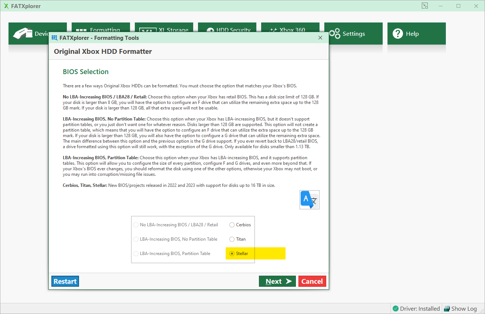

# FATXplorer

## Overview
[FATXplorer](https://fatxplorer.eaton-works.com/), developed by Eaton Works, offers a user-friendly interface for mounting an Xbox hard drive on Windows. Once you connect the hard drive to a PC, this tool facilitates easily formatting a hard drive along with mounting and file transfers.

## Formatting Tools
Start by clicking on ``Formatting Tools`` and then choose ``Original Xbox HDD``.

## Device Selection
Select the drive you wish to format and click ``Next``.

## BIOS Selection
Select ``Stellar`` as the BIOS and click ``Next``.

## Configure Partitions
Leave the default configuration and click ``Next``.

## Optional: Preload
Click ``Next``.

## Review
Click ``Format`` and you're all done!

# Additional Resources
* [Transfering Files - FATXplorer](/project-stellar/user-guide/xfer-files/fatexplorer)
