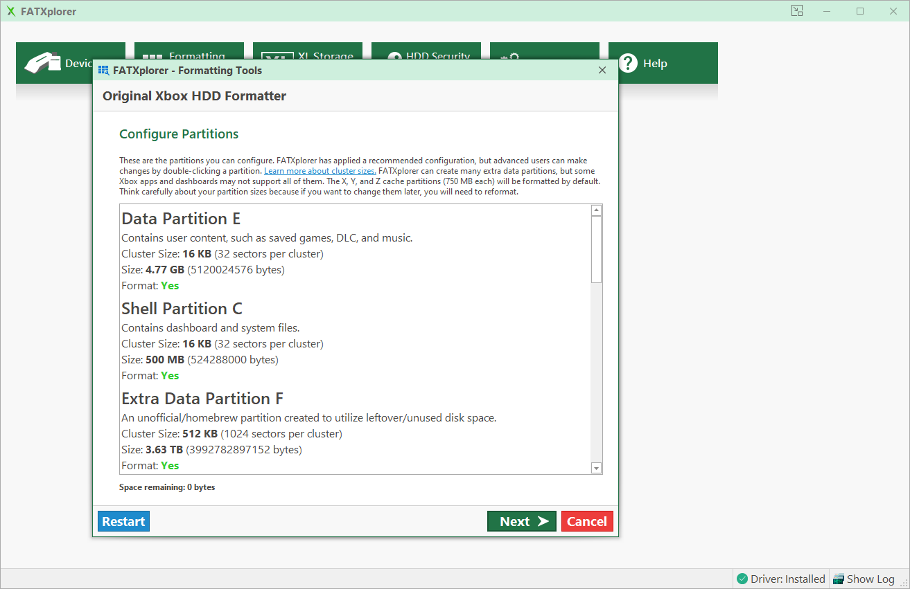
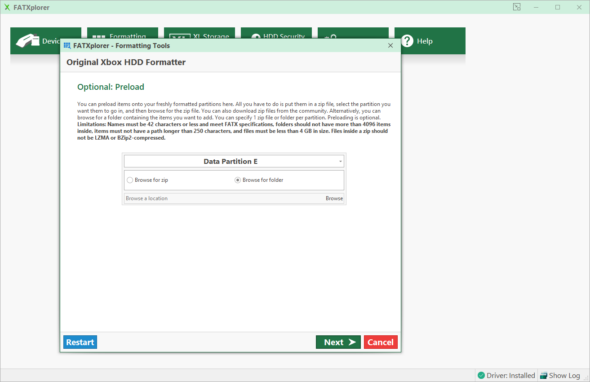
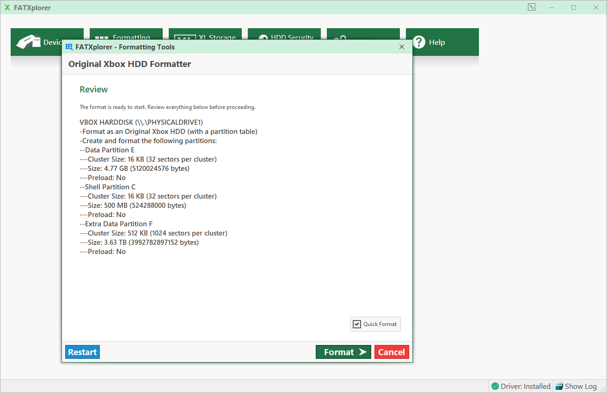

# FATXplorer

## Overview
[FATXplorer](https://fatxplorer.eaton-works.com/)

:::note
This guide is an independent work intended to help users understand and operate the software. It was created without
input or affiliation from the software's developer or publisher. All product names, logos, and trademarks are the
property of their respective owners and are used here for reference purposes only.
:::

## Formatting Tools
Start by clicking on ``Formatting Tools`` and then choose ``Original Xbox HDD``.

## Device Selection
Select the drive you wish to format and click ``Next``.

## BIOS Selection
Select ``Stellar`` as the BIOS and click ``Next``.

## Configure Partitions
Leave the default configuration and click ``Next``.

## Optional: Preload
Click ``Next``.

## Review
Click ``Format`` and you're all done!

# Additional Resources
* [Transfering Files - FATXplorer](/project-stellar/user-guide/xfer-files/fatexplorer)
