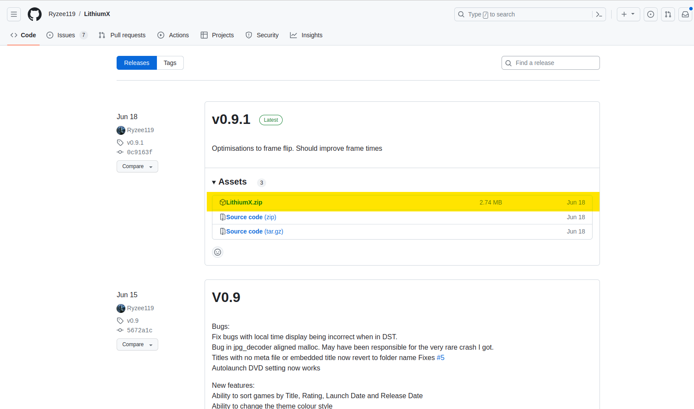

# LithiumX

## Overview
LithiumX is an open source dashboard focused on being simple with a clean UI.

## Installation
Navigate to [https://github.com/Ryzee119/LithiumX/releases](https://github.com/Ryzee119/LithiumX/releases) and download ``LithiumX.zip``.

Extract the contents and transfer the contents to ``F:\Dashboard``.

## Additional Resources
* [Transfering Files - StellarOS FTP](/project-stellar/user-guide/xfer-files/ftp)
* [Transfering Files - FATXplorer](/project-stellar/user-guide/xfer-files/fatexplorer)
* [LithiumX Website](./images/dash_main.jpg)
