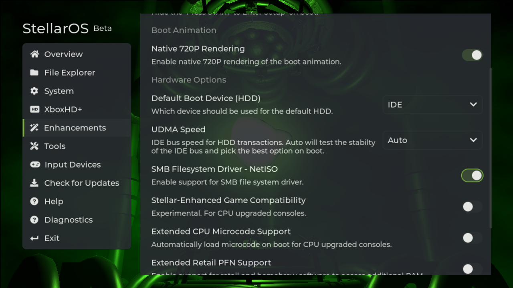

# Configuration
This guide will step you through enabling NetISO and adding a network share.

:::tip
Follow one of the ``Network Share Setup`` guides for an insight on how to setup an SMB share.
:::

## Enable SMB Filesystem Driver

In StellarOS under ``Enhancements`` enable ``SMB Filesystem Driver - NetISO``. Save and reboot.

## Adding Network Share
Back within StellarOS under ``File Explorer``, add a new network share with your network share information.

