# Windows PC

## Getting Started

Press the ``Windows Key + R`` and type ``compmgmt.msc`` and click ``OK``.
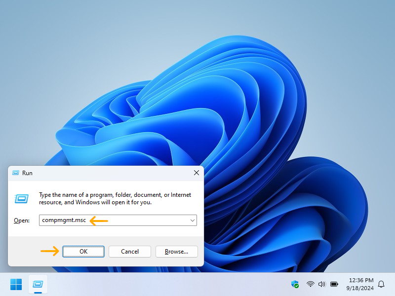

## Network Share
Share out the intended local directory containing your ISOs.

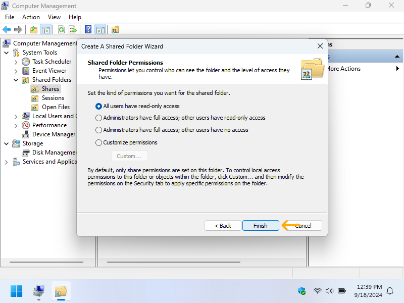

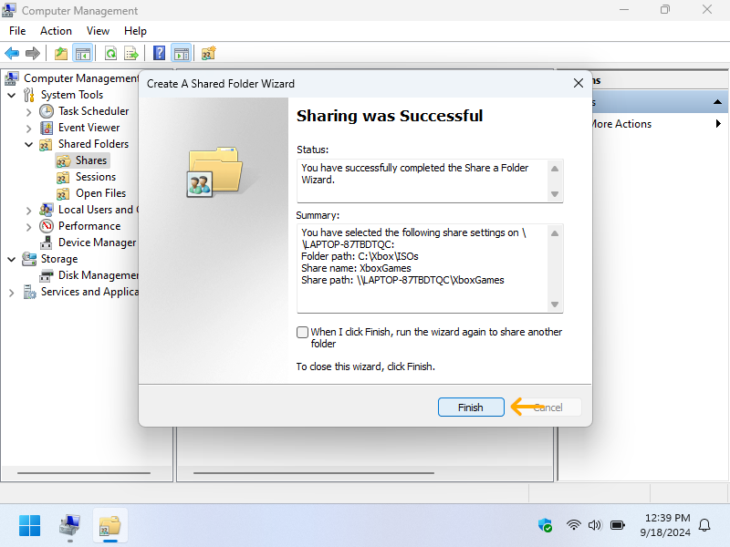

## User Authentication
Create a local user with a secure password.

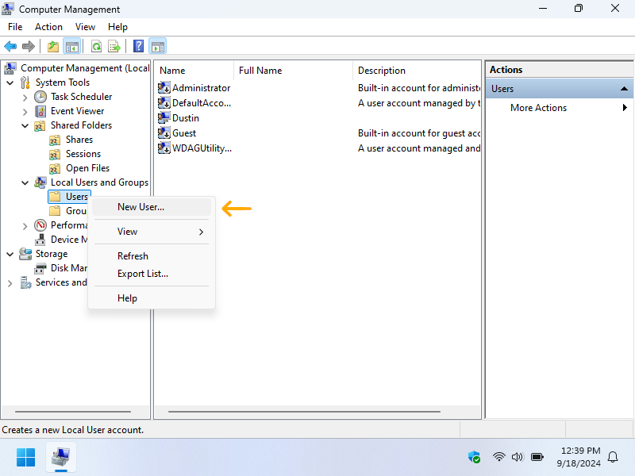

Add the user to the share and give them read permissions.

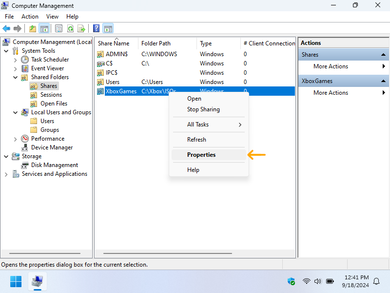

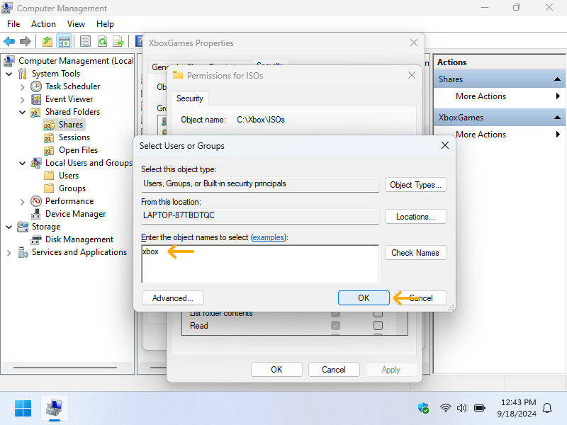

## Windows Firewall Exclusions
From Windows search, locate ``Windows Defender Firewall with Advanced Security``

Create a firewall exclusion from SMB traffic by right-clicking on the ``Inbound Rules``.

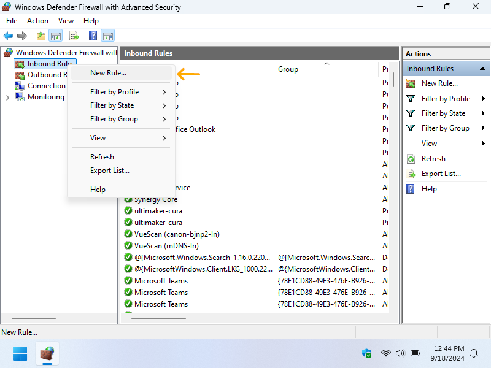

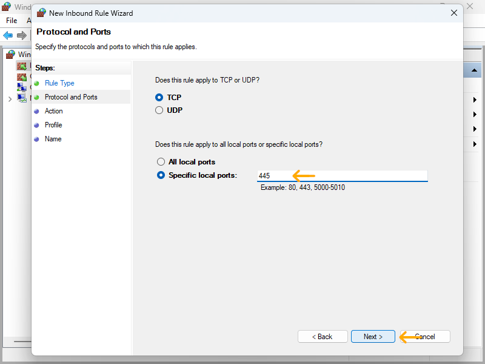

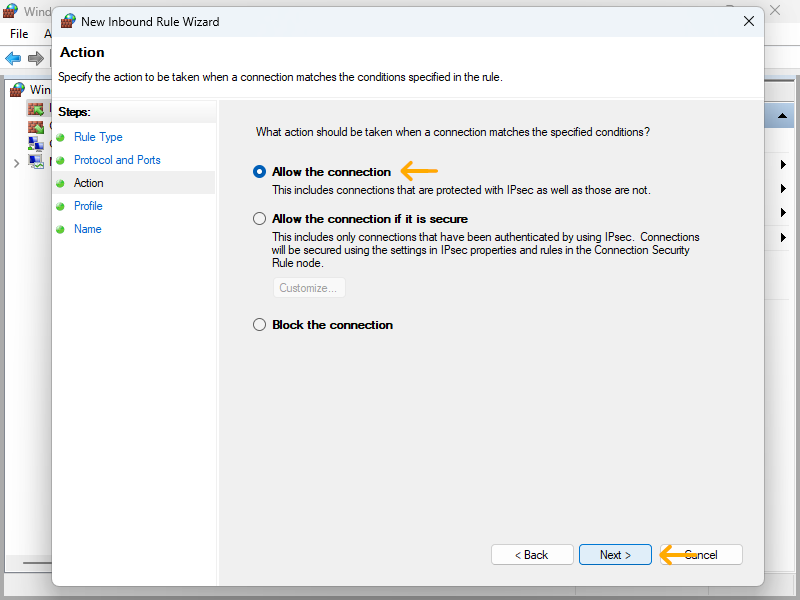

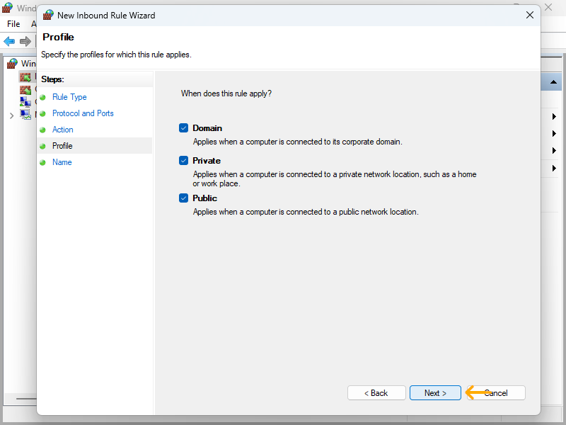

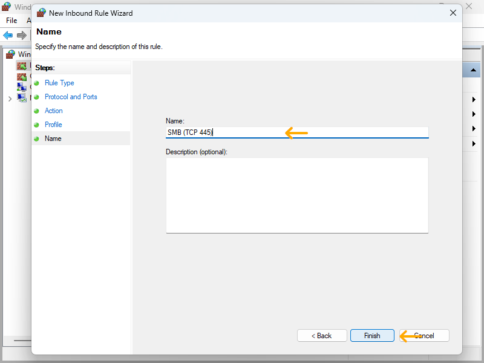

## Enabled SMB2
Run PowerShell as Adminstrator and execture the following two commands to enable and confirm SMB2 is enabled.

## StellarOS Share Config
Within StellarOS, under the ``Enhancements`` section, enable ``SMB Filesystem Driver - NetISO``, then save and reboot.

Back within StellarOS under ``File Explorer``, add a new network share with your information from above.

| Setting     | Value                       | Description                                   |
|-------------|-----------------------------|-----------------------------------------------|
| Share Name  | Laptop                      | You can name this whatever                    |
| Network URL | xbox@192.168.0.69/XboxGames | Replace the IP with your computer's IP        |
| Password    |                             | The xbox user password you've created above   |

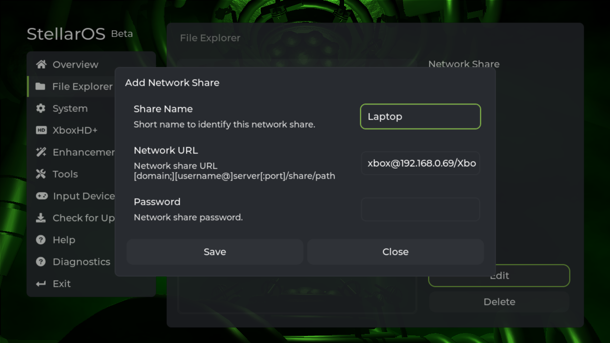

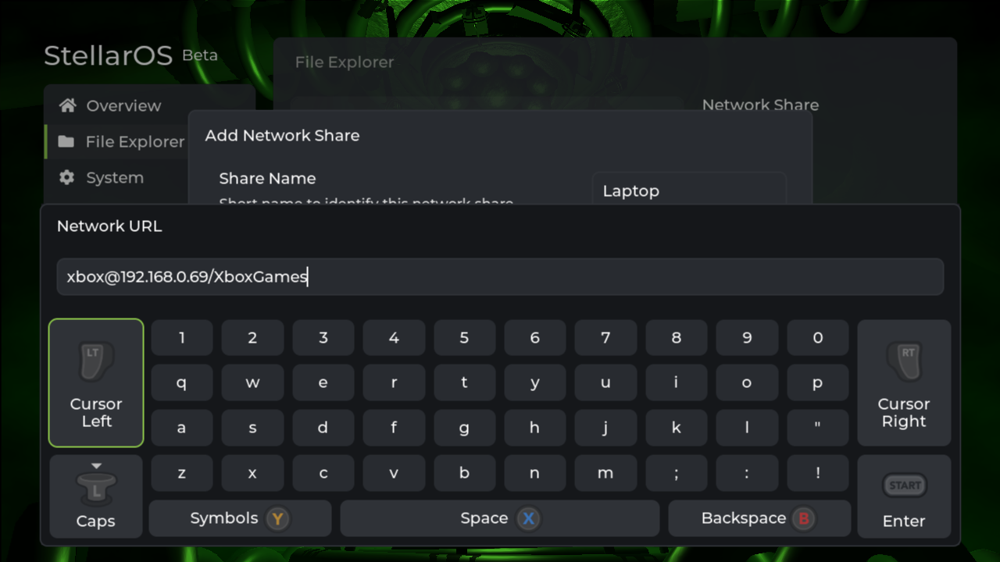
