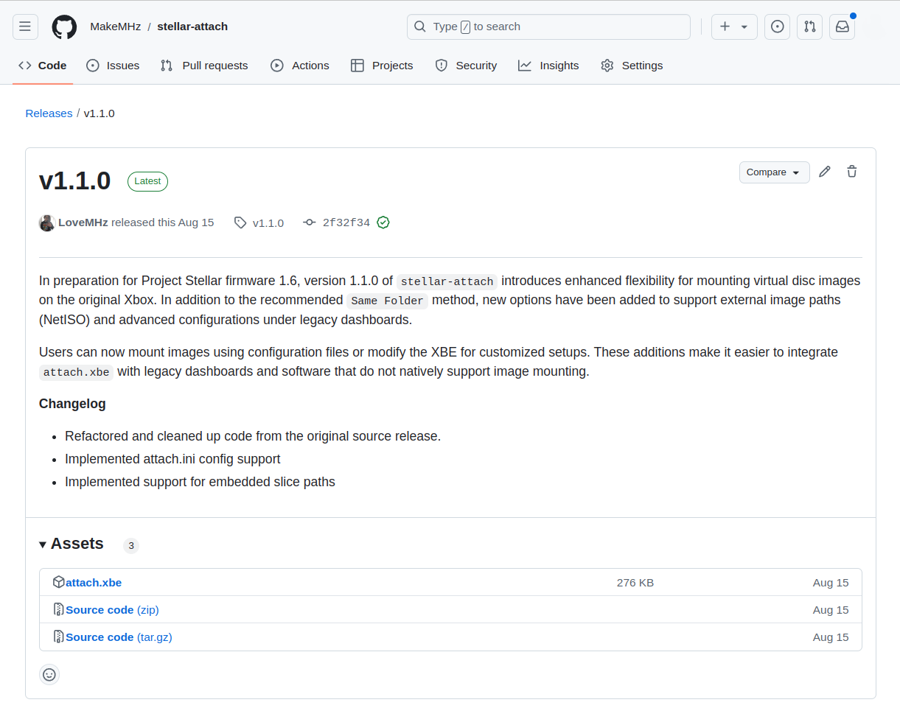

# Legacy Dashboards
Support for legacy dashboards is provided via [stellar-attach](https://github.com/MakeMHz/stellar-attach).
This tool allows you to use any legacy dashboard to directly launch ISO images over the network.

## Download Latest Release


Begin by downloading the latest release of ``attach.xbe`` from [https://github.com/MakeMHz/stellar-attach/releases/latest](https://github.com/MakeMHz/stellar-attach/releases/latest)

## Determining File Path
In StellarOS, navigate to the ``File Explorer`` and locate the ISO image you
wish to stream. Take note of the network device path, as you'll need it for
the configuration file.


In the example above, the configuration would be as followed:

```
VIRTUAL_IMAGE_FILE_PATH=\Device\Network\net0\Games\Xbox\007 - Agent Under Fire (USA).iso
```

## Creating Configuration File
Using a text editor of your choice, create a file named ``attach.ini``.

Inside this file, specify the path to your ISO image so that ``attach.xbe`` knows
where to find it. Depending on whether you're using a single ISO image or
split images, use one of the following templates as a guide.

**Single ISO Image**
```
VIRTUAL_IMAGE_FILE_PATH=\Device\Network\net0\Games\Xbox\4x4 Evo 2 (USA).iso
```

**ISO Image Split**
```
VIRTUAL_IMAGE_FILE_PATH=\Device\Network\net0\Games\Xbox\Halo (USA).1.iso
VIRTUAL_IMAGE_FILE_PATH=\Device\Network\net0\Games\Xbox\Halo (USA).2.iso
```

## Dashboard Setup
Transfer both ``attach.xbe`` and ``attach.ini`` to your Xbox, placing them in their own directory.

:::tip
In most cases, you would place them in a folder like ``F:\Games\Halo 2`` so your dashboard can detect and display the game.
:::


