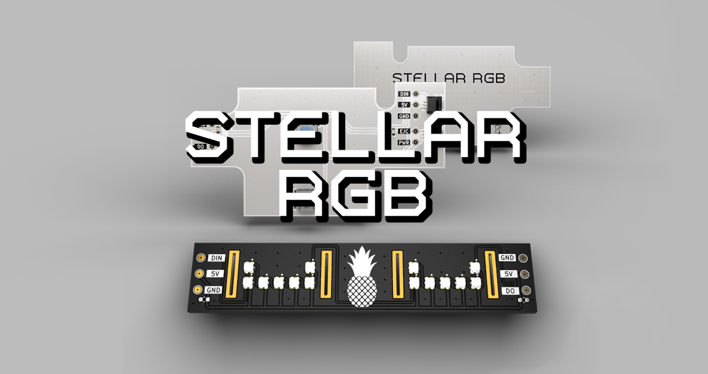
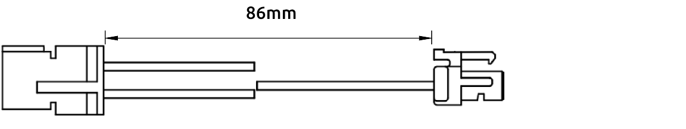
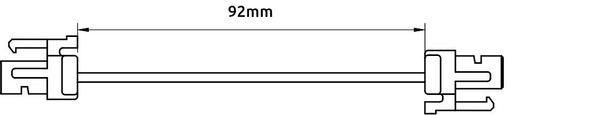
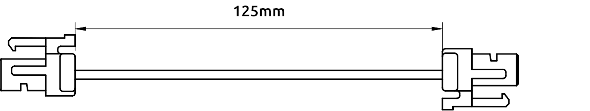
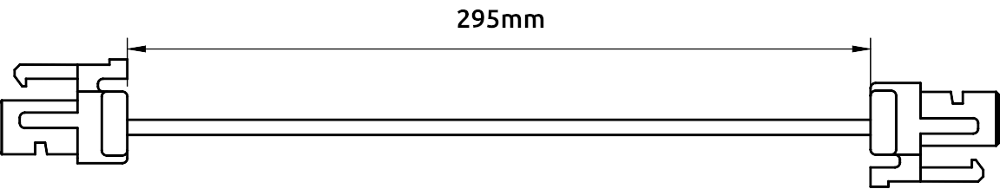
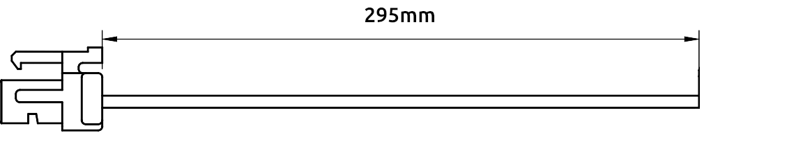

# Overview

Stellar RGB enhances the Original Xbox with dynamic lighting, seamless integration, and solderless installation, all built with customization and hackability in mind.

## Modular Design

### Front Panel to Xbox Motherboard

### Stellar or Controller Port to Controller Port

### Front Panel to Controller Port

### Front Panel to Stellar

### Ring of Lights

### DIY Cable

## Kit Components

### Ring of Lights + Controller Ports + Front Panel Kit
- Ring of Lights PCB
- Ring of Lights Cable

### Controller Ports + Front Panel Kit
- Controller Port PCB x2
- Front Panel PCB
- Stellar or Controller Port to Controller Port Cable x2
- Front Panel to Xbox Motherboard Cable
- Front Panel to Controller Port Cable

### Controller Ports Kit
- Controller Port PCB x2
- Stellar or Controller Port to Controller Port Cable x2

### Front Panel Kit
- Front Panel PCB
- Front Panel to Xbox Motherboard Cable
- Front Panel to Stellar

### Ring of Lights Kit
- Ring of Lights PCB
- Ring of Lights Cable

### DIY Cable
- DIY Cable
