# Ring of Lights

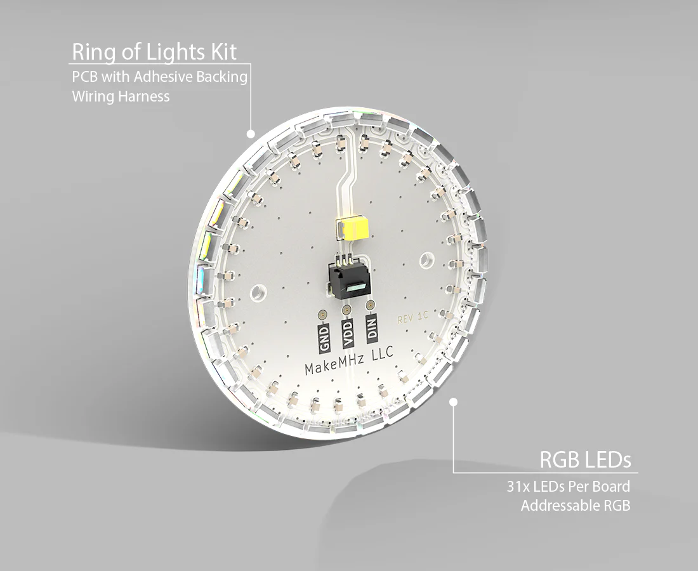

## Overview
The Ring of Lights kit adds addressable RGB lighting to the inside of the Xbox top shell. This guide walks you through the steps needed to install the kit, including minimal internal modifications and proper cable routing to avoid interference with existing components.

Installation requires drilling two small holes for cable pass-through, removing the top RF shield, and carefully placing the LED ring inside the shell. No soldering is required, and the kit connects directly to Stellar.

## Disassembly
The top RF shielding needs to be remove to install the Ring of Lights kit. It can be removed by lifting up on the metal tabs.

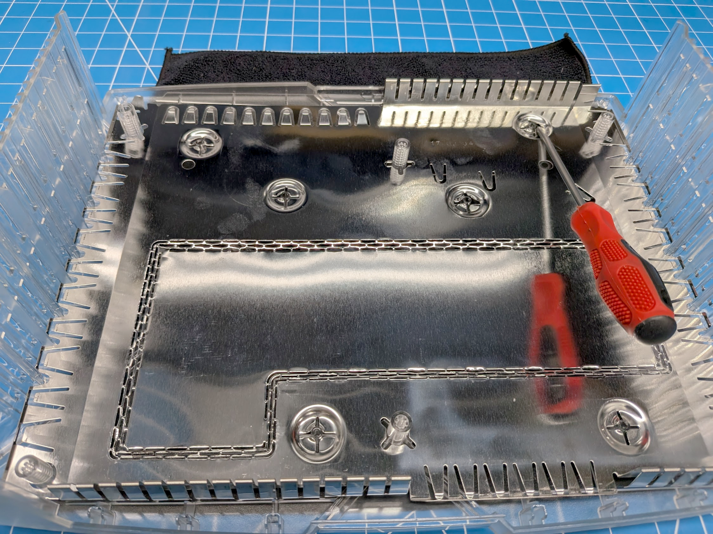

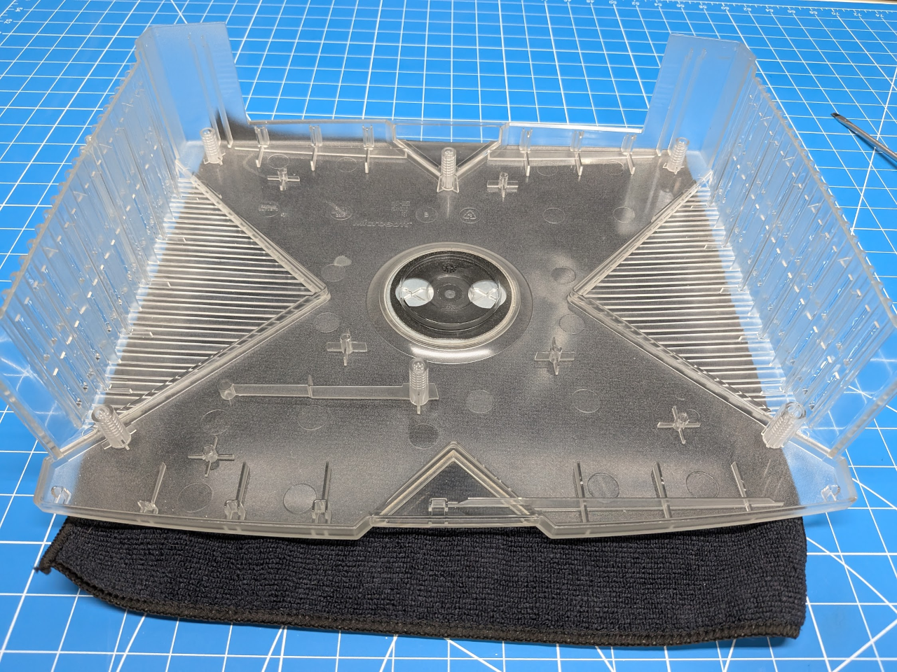

## Installation

Start by drilling a hole in the HDD tray to route the RGB cable. The hole only needs to be large enough for the connector to fit through. Then drill a matching hole in the DVD tray.

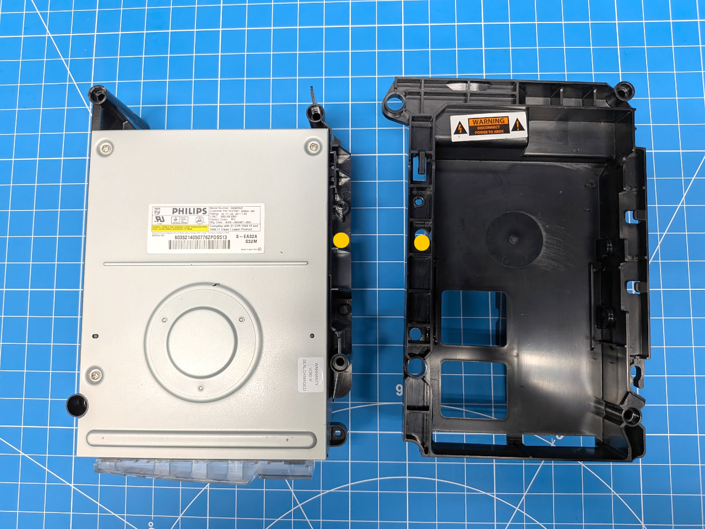

---

Connect the RGB cable to Stellar.

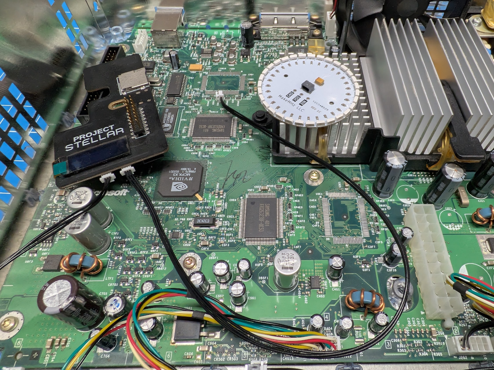

---

Reconnect the IDE and DVD drive cables. Double-check that everything else is properly connected.

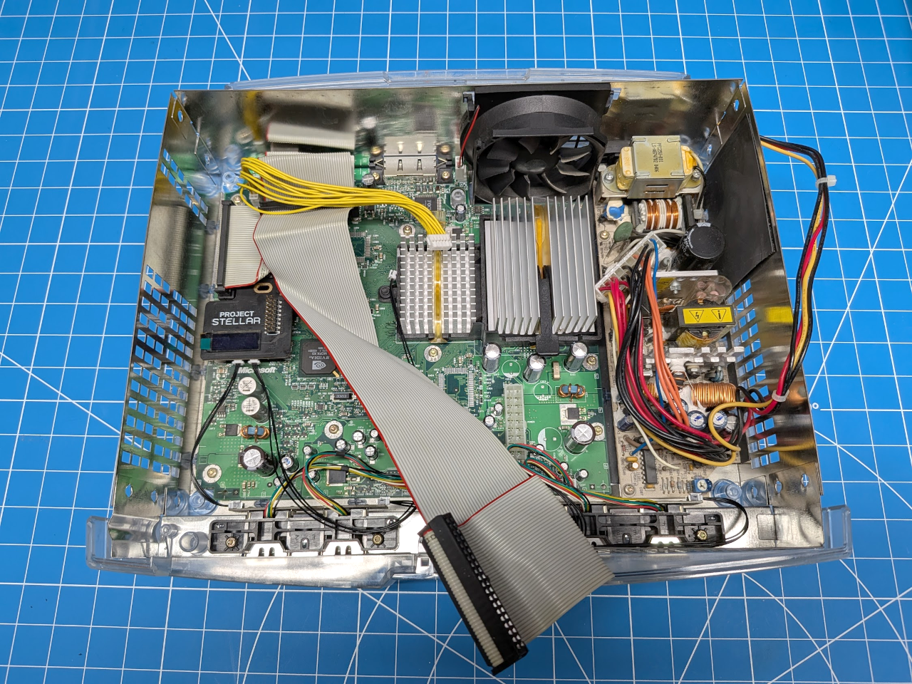

---

Reinstall the DVD tray, routing the RGB cable through the hole you drilled earlier. Gently pull any excess slack through, making sure the cable is not pinched or caught on the GPU heatsink or surrounding components.

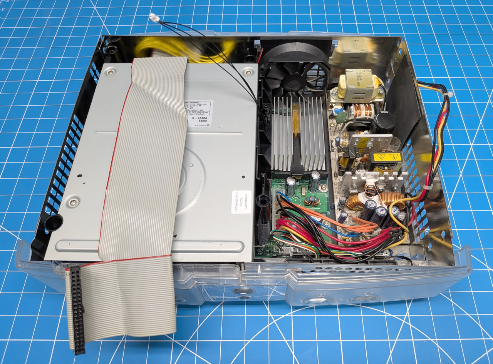

---

Reinstall the HDD tray and route the RGB cable through the second hole.

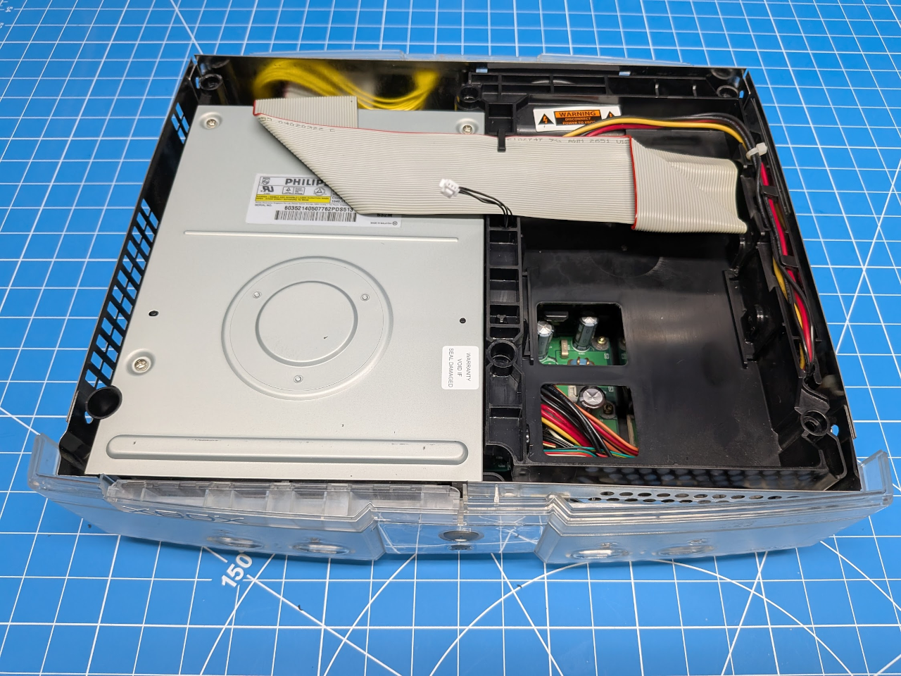

---

Peel off the adhesive backing from the Ring of Lights.

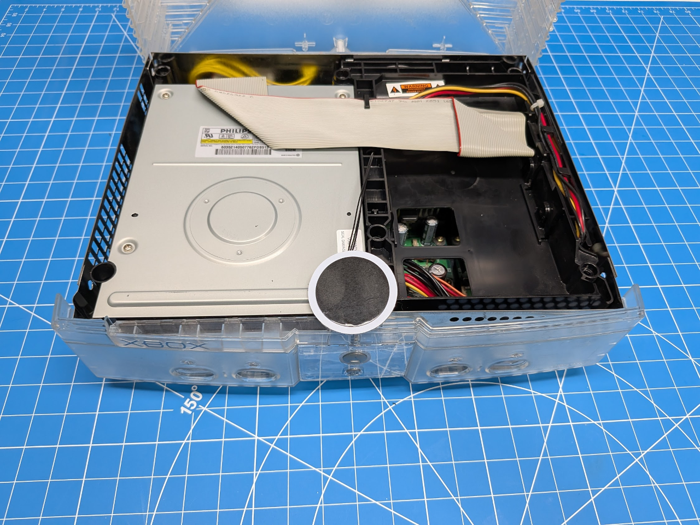

---

Hold the top shell above the console and carefully position the Ring of Lights in place on the shell.

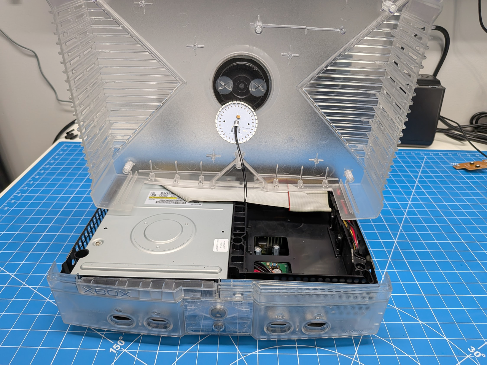

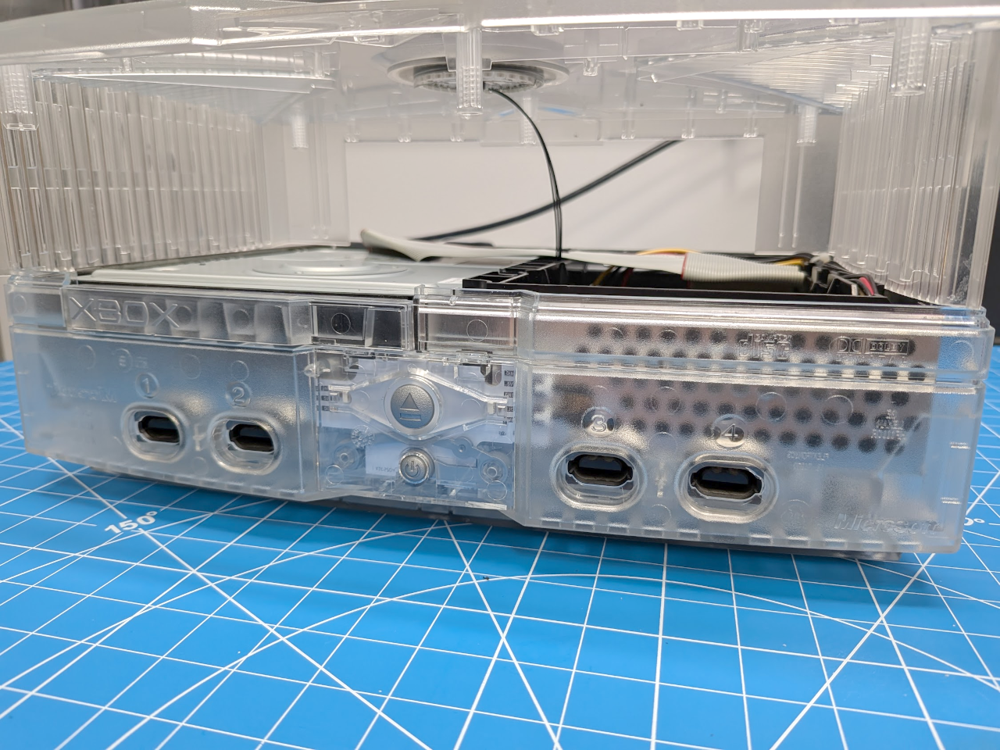
