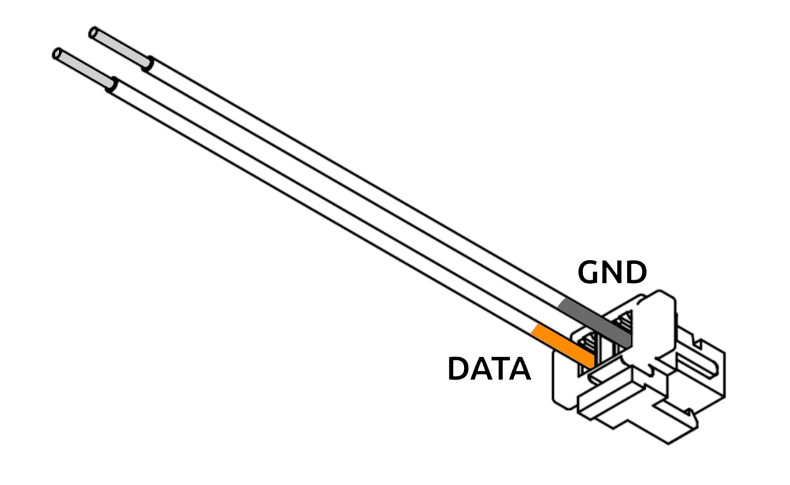
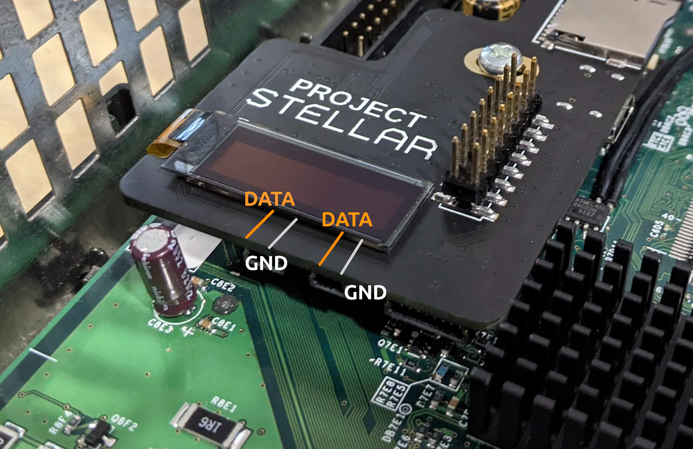

# DIY Cable

## Overview

:::warning
The DIY cable is intended for advanced users only. Incorrect wiring may damage your Stellar or Xbox.
:::

:::caution
Both GND and DATA lines must be connected. 5V is not supplied through the DIY cable. Additionally, DIY setups are not current-limited—you are responsible for ensuring the connected LEDs do not exceed safe current limits for your installation.
:::

### Wiring Breakout

### Wiring Overview

## Compatibility
Most 5V WS2812B LED strips are supported. Support for additional types may be added in future updates.

### Verified

[BTF-LIGHTING WS2812B IC RGB 5050SMD](https://www.amazon.com/dp/B01CDTEHRC)

## Showcase
Have a DIY RGB install you would like to show off? Let us know and we'll share it here!
