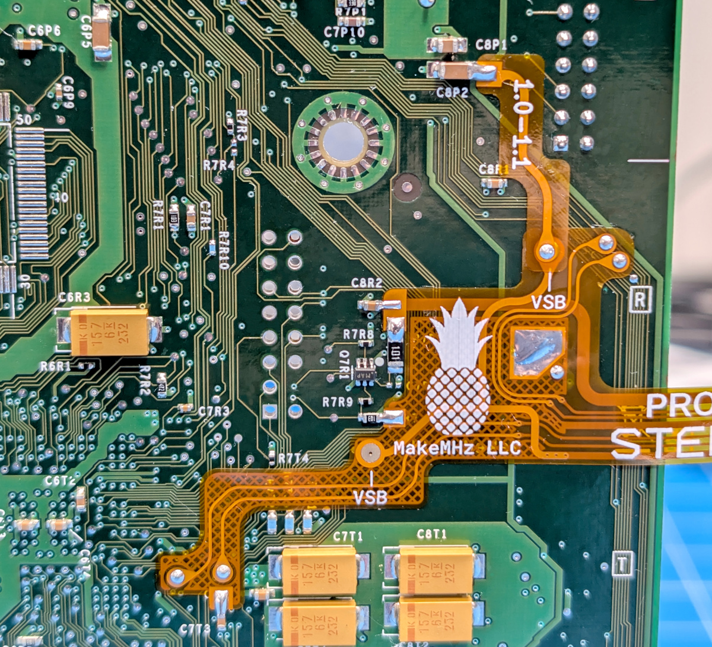
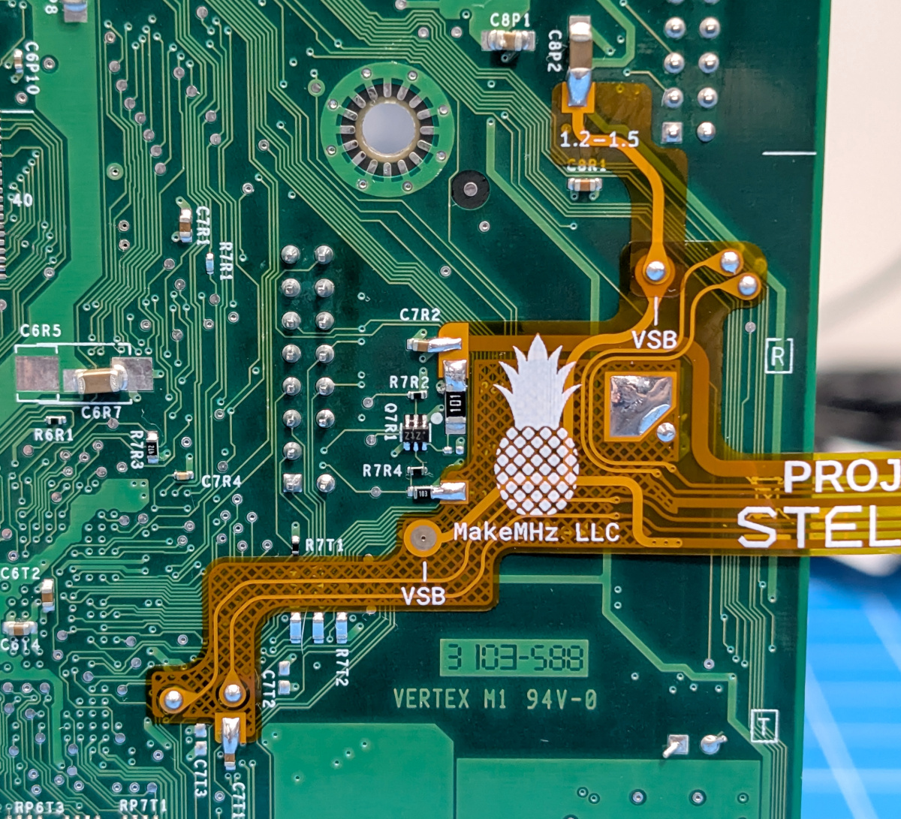
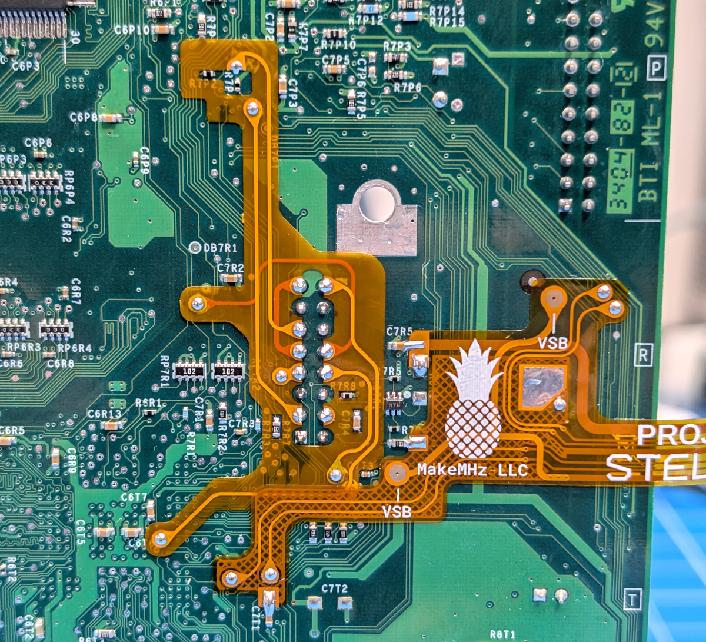
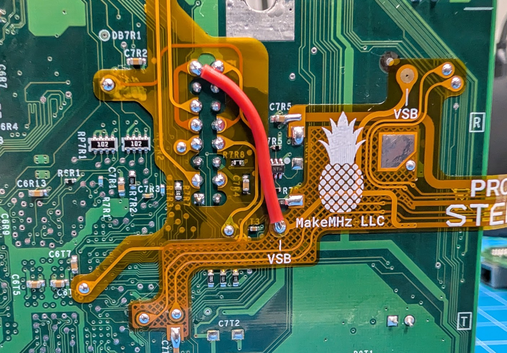
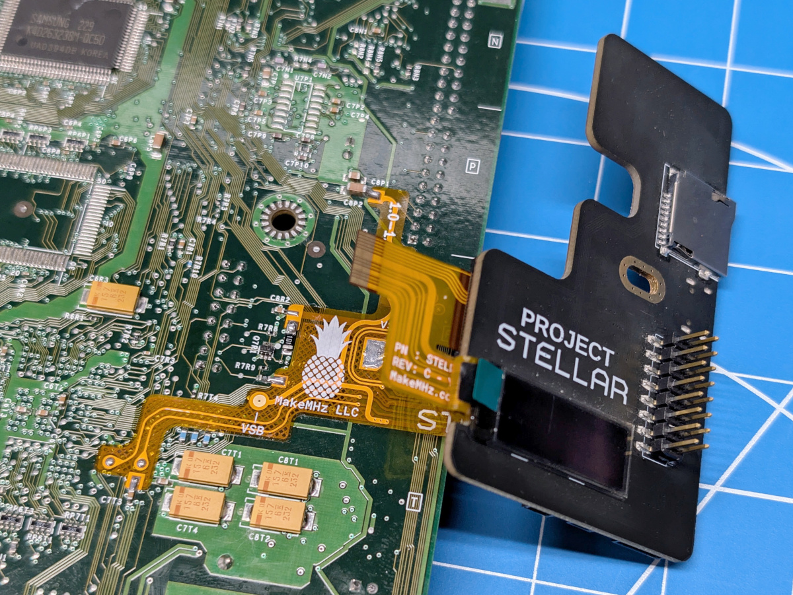
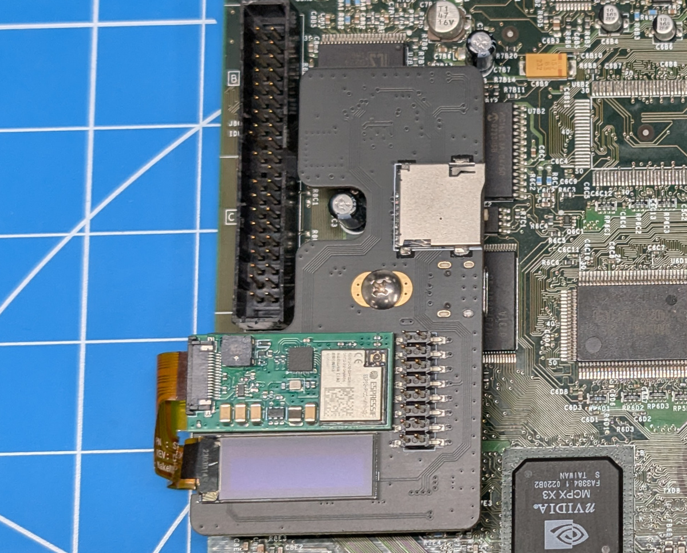
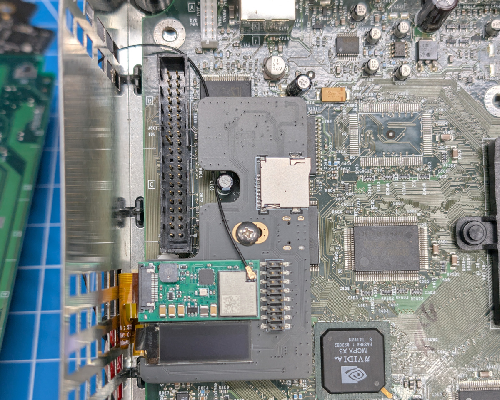

import Tabs from '@theme/Tabs';
import TabItem from '@theme/TabItem';

# Installation Guide
Installation guide for installing the Project Stellar Wireless upgrade.

### Kit Contents
Check your kit for missing or damaged pieces before moving forwards.

- Wireless Upgrade PCB
- Wireless Flex
- 1.0 - 1.1 Standby Power Flex
- 1.2 - 1.5 Standby Power Flex
- Red Wire

### Resources
[Identifying Xbox Revision](/xbox/identifying-xbox-revision)

## Step 1 - Initial Setup
This guide assumes that Project Stellar has already been installed and tested.

Before installing the Wireless Upgrade Kit, update Project Stellar to firmware 2.0.0 or newer.

Project Stellar can be updated to firmware 1.9.0 first, then updated again to 2.0.x using the
online update or offline XBE update method. It can also be updated directly to 2.0.x using the
[firmware recovery](/project-stellar/firmware-recovery) feature.

:::note
The Stellar Wireless Upgrade Kit is paired to a single device.
Once installed on a Project Stellar board, the Wireless Upgrade cannot be transferred to another Project Stellar.
:::

## Step 2 - Wireless Upgrade Flex

The wireless flex installation points vary by motherboard version, so make sure you are following the correct layout
for your console. Carefully compare the photo with your board before soldering.

**Select the tab below that matches your Xbox motherboard revision before continuing.**

<Tabs groupId="xbox-rev">
<TabItem value="1" label="Xbox 1.0 - 1.1">

- **Position the Stellar Wireless flex cable and carefully align it with the board.** Confirm that all contact points are lined up
correctly, and that each test pad matches the corresponding pad on the flex.
- Position the 1.0 - 1.1 standby power flex cable and solder it into place.
- **Optional, but highly recommended:** Add the minimum amount of solder needed to the large ground pad to firmly secure the wireless
flex to the Xbox motherboard. Do not use too much solder. Excess solder can prevent the motherboard from sitting flat in the console shell.

</TabItem>
<TabItem value="2" label="Xbox 1.2 - 1.5">

- **Position the Stellar Wireless flex cable and carefully align it with the board.** Confirm that all contact points are lined up
correctly, and that each test pad matches the corresponding pad on the flex.
- Position the 1.2 - 1.5 standby power flex cable and solder it into place.
- **Optional, but highly recommended:** Add the minimum amount of solder needed to the large ground pad to firmly secure the wireless
flex to the Xbox motherboard. Do not use too much solder. Excess solder can prevent the motherboard from sitting flat in the console shell.

</TabItem>
<TabItem value="6" label="Xbox 1.6">

- **Position the Stellar Wireless flex cable and carefully align it with the board.** Confirm that all contact points are lined up
correctly, and that each test pad matches the corresponding pad on the flex.
- **Optional, but highly recommended:** Add the minimum amount of solder needed to the large ground pad to firmly secure the wireless
flex to the Xbox motherboard. Do not use too much solder. Excess solder can prevent the motherboard from sitting flat in the console shell.

Due to differences in LPC rebuild methods, remote power-on support requires one additional wire connection when installing the
Stellar Wireless Upgrade Kit.

This step is optional and only applies to the Stellar Wireless Upgrade Kit on a 1.6 console. It does not apply to Stellar Plus
installations.

</TabItem>
</Tabs>

## Step 3 - Flex Connection

Connecting the Wireless Upgrade flex to Project Stellar and the upgrade PCB is not difficult, but it does involve multiple steps.
Take your time and handle the flex carefully.

Start with the Xbox motherboard flipped upside down. Connect the wide end of the flex to Project Stellar, making sure it is inserted
straight and fully seated in the connector.

Carefully flip the Xbox motherboard right side up.

Place the PCB spacer on the Xbox motherboard, then plug Project Stellar back in. Insert the screw into the mounting hole on Project
Stellar to help keep the spacer from moving during installation.

Remove the backing from the adhesive on the Wireless Upgrade PCB, then place the board as shown in the image below.

## Step 4 - Shielding Modification

Before reinstalling the motherboard, make a small modification to the Xbox RF shielding so the antenna can pass through.
Use side cutters to remove the small metal tab shown in the image below.

:::note
Modifying the RF shielding is not required, but it is highly recommended. Following this step helps keep the antenna routing simple
and makes the installation easier.
:::

## Step 5 - Mounting

- Place the Xbox motherboard back into the console.
- Use the provided Phillips screw to mount Project Stellar. Do not over-tighten, the screw only needs to be lightly tightened.
- Connect the WiFi antenna. [Three Quick Tips About Using U.FL](https://learn.sparkfun.com/tutorials/three-quick-tips-about-using-ufl/all)

Carefully route the antenna cable between the IDE connector and the DVD power cable, then pass it through the opening in the RF
shielding made in the previous step.

Keep the cable loose with a gentle curve to avoid placing stress on the cable or connector.

## Step 5 - Antenna Routing

Route the antenna cable along the edge of the console shell.
Remove the backing from the double-sided tape on the antenna, then secure the antenna in place as shown below.

## Step 6 - Testing
It is recommended to test the Wireless Upgrade by powering on the Xbox before reconnecting the DVD drive or hard drive.

Once wireless connectivity has been confirmed, add a small dab of hot glue over the WiFi antenna connector.
This helps prevent the antenna from disconnecting and potentially causing a short inside the console.
