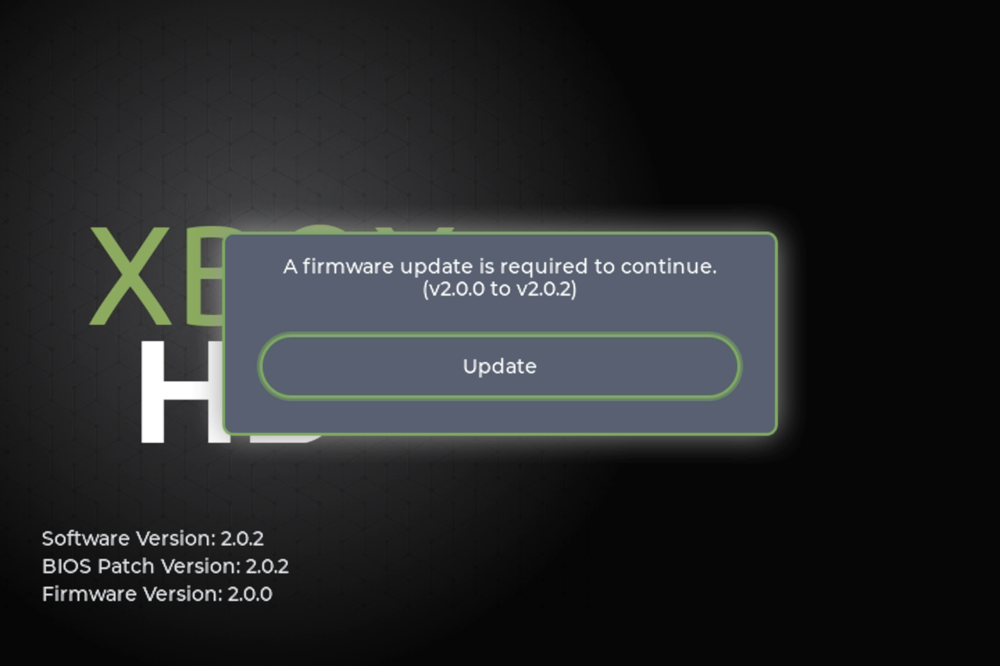

# Upgrading to XboxHD+
This guide is for upgrading existing XboxHDMI, firmware 1.x.x, installs to XboxHD+.

### Checklist
- [ ] OpenXenium installed.
  - [ ] Tested and verified that OpenXenium is accessible via network. (Both HTTP and FTP)
- [ ] System is fully working.
  - [ ] System has no stablity issues.

## Hard Drive Preparation

### Step 1
Boot console to XeniumOS via the eject button.

### Step 2
Download the latest XboxHD+ app release.

[Latest Release](https://github.com/MakeMHz/xbox-hd-plus-app2/releases/latest)

### Step 3
Extract the files and FTP over contents to the C drive. Files must be placed on the C drive. (Inside of a folder called 'xboxhd' as shown)

### Step 4
Leave Xbox on and continue to the next section.

## Patching BIOS with kpatcher support

### Step 1
Download the latest kpatch IPS file for your BIOS of choice.

[BIOS Patches](https://github.com/MakeMHz/xbox-hd-plus/blob/master/patches/README.md)

### Step 2
Apply patch to BIOS by following the link to the patching guide for the corresponding BIOS patch. (Due to legal reasons we can not distribute the BIOS files)

### Step 3
FTP the patched BIOS file over to Xbox. It's recommended to store the BIOS file inside of a folder on the C drive called 'BIOS' for future refrences.

### Step 4
Flash BIOS.

### Step 5
Set the newly flashed BIOS as the default BIOS.

### Step 6 (Optional/Recommended)
Ensure that 'Instant Boot' is enabled. This automatically boot the default BIOS on power up.

## Firmware Update
At this point you can reboot the Xbox. This will boot the patched BIOS.

### Step 1
Launch the XboxHD+ app.

### Step 2
Apply update. The update will wait 2 minutes before flashing the firmware update.

:::caution
Do not turn off the Xbox once the front LEDs turn orange. Doing so can/will brick the XboxHDMI/XboxHD+.
:::

# Step 3
Repeat by launching the XboxHD+ app again. Depending on the starting firmware you may have to update multiple times.

## All Done
And that's it!
