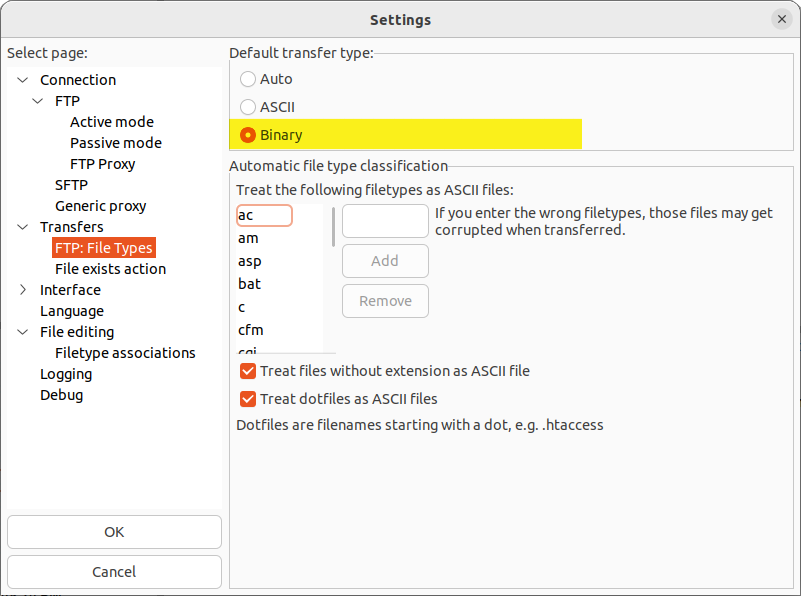

# StellarOS FTP

## Overview
StellarOS has a built-in FTP server inside. By booting into StellarOS, you can use an FTP client to connect and transfer files.

|          |      |
|----------|------|
| **Username** | xbox |
| **Password** | xbox |
| **Port**     | 21   |

## Entering StellarOS
The first step is to enter StellarOS. The Xbox console must be on and inside of StellarOS for the FTP server to function.

[Entering Stellar](/project-stellar/user-guide/stellar-os/entering-stellar-os)

## Installing an FTP Client
We recommend the free FileZilla FTP client for its simplicity. However, if you have another FTP client you're fond of, you're welcome to use it. While this guide will center on FileZilla, the underlying principles should remain consistent across different clients!

## FTP Client Settings

### Maximum Simultaneous Transfers
StellarOS is optimized, and requires, maximum simultaneous transfers to be set to 1.

### Default Transfer Type
``Default Transfer Type`` must be set to ``Binary`` to ensure that files are transfered without conversion.

## Connecting to StellarOS
After correctly setting up Filezilla, you can establish a connection to the Xbox. Input the ``IP Address`` displayed by StellarOS, use ``xbox`` for both the ``Username`` and ``Password`` fields, and set the ``Port`` to ``21``.

## Transfering Files
Upon connecting via FTP, you'll encounter distinct folders representing each drive partition (C, E, F, and so on).

:::tip
Comprehensive details about these partitions can be found on the [Xbox Technical Info - Hard Drive Partitions](/xbox/xbox-info/hdd-partitions) page.
:::

Within Filezilla, you can conveniently drag and drop files either from your computer to the window on the right or vice versa, from the left side of the window.

## Additional Resources
* [Xbox Technical Info - Hard Drive Partitions](/xbox/xbox-info/hdd-partitions)
* [FileZilla Client Tutorial (en)](https://wiki.filezilla-project.org/FileZilla_Client_Tutorial_(en))
* [FileZilla - Using](https://wiki.filezilla-project.org/Using)
